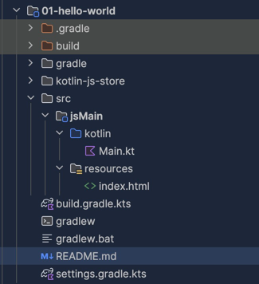

# 01-hello-world

伝統的に、プログラミング言語の最初のプログラムは "Hello, World!" というメッセージを表示するものです。

kotlin/js は基本的に gradle でプロジェクトを構成することになります。
gradle の設定は以下のようになります。

通常の Kotlin/JVM の場合は `kotlin("jvm")` を指定しますが、Kotlin/JS の場合は `kotlin("multiplatform")` を指定します。
kotlin multiplatform となるため依存の書き方にちょっと癖がありますが、自然となれます。

```kotlin
plugins {
    kotlin("multiplatform") version "1.9.23"
}

kotlin {
    js {
        browser {
            binaries.executable()
        }
    }
    sourceSets {
        val jsMain by getting {
            dependencies {
            }
        }
        val jsTest by getting {
            dependencies {
                implementation(kotlin("test"))
            }
        }
    }
}

repositories {
    mavenCentral()
}
```

Kotlin multiplatform では以下のようなディレクトリ構造とします。
通常の kotlin/JVM プロジェクトとはちがって、src/jsMain/kotlin といったディレクトリにコードを書いていくのが特徴ですね。



src/jsMain/resources/index.html に以下のような HTML を書いておきます。
非常にシンプルですね。

```html
<!doctype html>
<html lang="ja">
<head>
    <meta charset="UTF-8">
    <title>Hello World</title>
</head>
<body>
    <div id="root">Hello World</div>
    <script src="01-hello-world.js"></script>
</body>
</html>
```

src/jsMain/kotlin/Main.kt に以下のような Kotlin のコードを書いておきます。
今回は hello world なので、console にメッセージを出力して、HTML の root にメッセージを表示するようにしています。

JS ではよく使う console オブジェクトは `kotlin.js.console` として定義されており、特に何もインポートしなくても使えます。
[source](https://github.com/JetBrains/kotlin/blob/master/libraries/stdlib/js/src/kotlin/debug.kt)

document オブジェクトは `kotlinx.browser.document` として定義されており、こちらはインポートが必要です。
依存の追加は必要ありません。`kotlin-dom-api-compat` は暗黙的に依存として利用可能なためです。
[source](https://github.com/JetBrains/kotlin/blob/master/libraries/stdlib/js/src/kotlinx/browser/declarations.kt)

`main` 関数は js が読み込まれたときに自動的に実行されます。

```kotlin
package org.example

import kotlinx.browser.document

fun main() {
    console.log("Hello Console World!")

    document.getElementById("root")?.textContent = "Hello Kotlin World!"
}
```

ここまで実行できると、以下のようにして、コードを実行することができます。

```shell
./gradlew jsRun -t
```

ブラウザが http://localhost:8082 を参照して起動して、以下のような画面が表示されます。

- console に文字列が表示されて `Hello Console World!` と表示されています。
- HTML の root に文字列が表示されて `Hello Kotlin World!` と表示されています。


ということで、Kotlin/JS で Hello World を表示することができました。

`./gradlew jsRun -t` の `-t` オプションは開発モードに入ることを示していて、このオプションをつけておくと、コードを変更したときに自動的にビルドしてブラウザをリロードしてくれます。

## SEE ALSO

- Kotlin/JS の gradle の設定については公式ドキュメントの [Set up a Kotlin/JS project
  ](https://kotlinlang.org/docs/js-project-setup.html) を参照してください。
