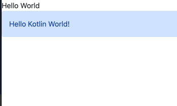

# Kotlin/JS と bootstrap

Kotlin/JS を使うとしても、CSS フレームワークは使いたい。
そんな場合にはいくつか候補がありますが、僕個人は twitter bootstrap に慣れているので、bootstrap を使うことを例として解説します。

## インストール

`build.gradle.kts` に以下のように追記します。

<<< ./build.gradle.kts{kotlin}

npm モジュールのインストールも簡単にできるのが kotlin/JS の良いところですね。

bootstrap の CSS の読み込みは以下のようにします。

<<< ./src/jsMain/kotlin/Main.kt{kotlin}

以下のような画面表示となり、bootstrap の CSS が適用されていることがわかります。

このほかに、`webpack.config.d` に設定をかいて、webpack のレイヤーで処理する方法もあります。
[fritz2-tailwind-template](https://github.com/jwstegemann/fritz2-tailwind-template/tree/main) のやり方が参考になるでしょう。
