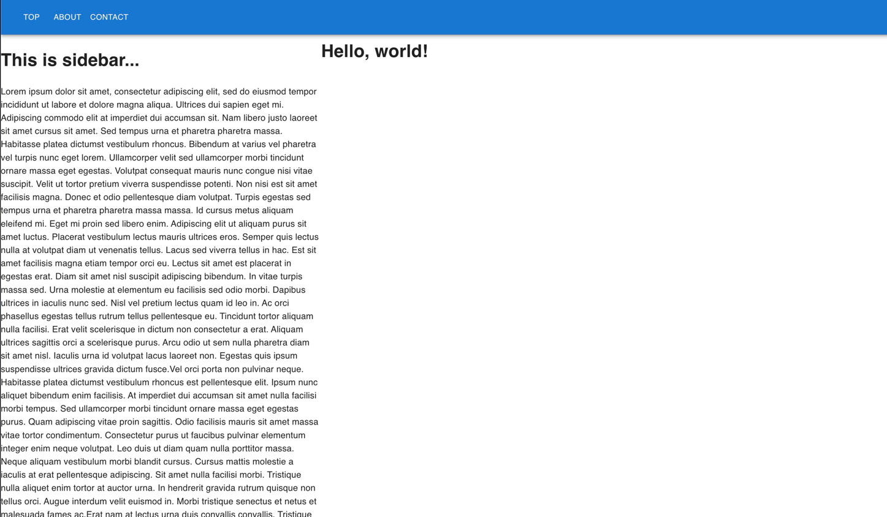

# MUI を使う

[MUI](https://mui.com/) は react をベースにした material ui のライブラリです。
React のコンポーネントが大量に提供されており、これを使えば美麗なライブラリを簡単に実装することができます。

## セットアップ

<<< ./build.gradle.kts{kotlin}

## コード

<<< ./src/jsMain/kotlin/Main.kt{kotlin}

これだけで、以下のようにトップバーとサイドバーをもった画面を構築することができます。

